# WEB-LAB-10
<p align = "center">МИНИСТЕРСТВО НАУКИ И ВЫСШЕГО ОБРАЗОВАНИЯ<br>
РОССИЙСКОЙ ФЕДЕРАЦИИ<br>
ФЕДЕРАЛЬНОЕ ГОСУДАРСТВЕННОЕ БЮДЖЕТНОЕ<br>
ОБРАЗОВАТЕЛЬНОЕ УЧРЕЖДЕНИЕ ВЫСШЕГО ОБРАЗОВАНИЯ<br>
«САХАЛИНСКИЙ ГОСУДАРСТВЕННЫЙ УНИВЕРСИТЕТ»</p>
<br><br><br><br><br><br>
<p align = "center">Институт естественных наук и техносферной безопасности<br>Кафедра информатики<br>Шинкаренко Кирилл Константинович</p>
<br><br><br>
<p align = "center"><br><strong>Лабораторная работа №10.«JS»</strong><br>01.03.02 Прикладная математика и информатика</p>
<br><br><br><br><br><br><br><br><br><br><br><br>
<p align = "right">Научный руководитель<br>
Соболев Евгений Игоревич</p>
<br><br><br>
<p align = "center">г. Южно-Сахалинск<br>2024 г.</p>
<br><br><br><br><br><br><br><br><br><br><br><br>

<h1 align = "center">Введение</h1>

<p><b>HTML</b> —  стандартизированный язык гипертекстовой разметки документов для просмотра веб-страниц в браузере. Веб-браузеры получают HTML документ от сервера по протоколам HTTP/HTTPS или открывают с локального диска, далее интерпретируют код в интерфейс, который будет отображаться на экране монитора.</p>
<p><b>CSS</b> — формальный язык описания внешнего вида документа, написанного с использованием языка разметки. Также может применяться к любым XML-документам, например, к SVG или XUL.</p>


<h1 style="text-align: center">Задачи js</h1>
<ol>
    <li>Треугольник. Напишите цикл,  выводит такой треугольник:
    </li>
    <li>FizzBuzz. Напишите программу, которая выводит через console.log все числа от 1 до 100, с двумя исключениями. Для чисел, нацело делящихся на 3, она должна выводить ‘Fizz’, а для чисел, делящихся на 5 (но не на 3) – ‘Buzz’.Когда сумеете – исправьте её так, чтобы она выводила «FizzBuzz» для всех чисел, которые делятся и на 3 и на 5.</li>
    <li>Шахматная доска. Напишите программу, создающую строку, содержащую решётку 8х8, в которой линии разделяются символами новой строки. На каждой позиции либо пробел, либо #. </li>
    <li>Минимум. Напишите функцию min, принимающую два аргумента, и возвращающую минимальный из них.</li>
    <li>Рекурсия. Ноль чётный. Единица нечётная. У любого числа N чётность такая же, как у N-2. Напишите рекурсивную функцию isEven согласно этим правилам. Она должна принимать число и возвращать булевское значение. Потестируйте её на 50 и 75. Попробуйте задать ей -1. Почему она ведёт себя таким образом? Можно ли её как-то исправить?</li>
    <li>Считаем бобы. Символ номер N строки можно получить, добавив к ней .charAt(N) ( “строчка”.charAt(5) ) – схожим образом с получением длины строки при помощи .length. Возвращаемое значение будет строковым, состоящим из одного символа (к примеру, “к”). У первого символа строки позиция 0, что означает, что у последнего символа позиция будет string.length – 1. Другими словами, у строки из двух символов длина 2, а позиции её символов будут 0 и 1.Напишите функцию countBs, которая принимает строку в качестве аргумента, и возвращает количество символов “B”, содержащихся в строке.Затем напишите функцию countChar, которая работает примерно как countBs, только принимает второй параметр — символ, который мы будем искать в строке (вместо того, чтобы просто считать количество символов “B”). Для этого переделайте функцию countBs.</li>
    <li>Сумма диапазона.  Напишите функцию range, принимающую два аргумента, начало и конец диапазона, и возвращающую массив, который содержит все числа из него, включая начальное и конечное.Затем напишите функцию sum, принимающую массив чисел и возвращающую их сумму. Запустите указанную выше инструкцию и убедитесь, что она возвращает 55.В качестве бонуса дополните функцию range, чтобы она могла принимать необязательный третий аргумент – шаг для построения массива. Если он не задан, шаг равен единице. Вызов функции range(1, 10, 2) должен будет вернуть [1, 3, 5, 7, 9]. Убедитесь, что она работает с отрицательным шагом так, что вызов range(5, 2, -1) возвращает [5, 4, 3, 2].</li>
    <li>Обращаем массив вспять. Напишите две функции, reverseArray и reverseArrayInPlace. Первая получает массив как аргумент и выдаёт новый массив, с обратным порядком элементов. Вторая работает как оригинальный метод reverse – она меняет порядок элементов на обратный в том массиве, который был ей передан в качестве аргумента. Не используйте стандартный метод reverse.</li>
    <li>Глубокое сравнение. Оператор == сравнивает переменные объектов, проверяя, ссылаются ли они на один объект. Но иногда полезно было бы сравнить объекты по содержимому. Напишите функцию deepEqual, которая принимает два значения и возвращает true, только если это два одинаковых значения или это объекты, свойства которых имеют одинаковые значения, если их сравнивать рекурсивным вызовом deepEqual. Чтобы узнать, когда сравнивать величины через ===, а когда – объекты по содержимому, используйте оператор typeof. Если он выдаёт “object” для обеих величин, значит нужно делать глубокое сравнение. Не забудьте об одном дурацком исключении, случившемся из-за исторических причин: “typeof null” тоже возвращает “object”.</li>
    <li>Свертка. Используйте метод reduce в комбинации с concat для свёртки массива массивов в один массив, у которого есть все элементы входных массивов.
    </li>
</ol>


<h1 style="text-align: center">Решения</h1>

<h2 style="text-align: center">Файлы 1 - 13.js</h2>

1
```js
function devidedBy(array, devider) {
    return array.filter((val) => val % devider == 0);
}

console.log(devidedBy([10, 11, 9, 27], 3));
```

2
```js
function isAnagramms(str1, str2) {
    str1 = str1.toLowerCase();
    str2 = str2.toLowerCase();

    let chars1 = str1.split('').sort().join('');
    let chars2 = str2.split('').sort().join('');

    return chars1 === chars2;
}

console.log(isAnagramms("Helo", "olleH"));
```

3
```js
function countVowels(str) {
    let vowels = ['a', 'e', 'i', 'o', 'u'];
    let count = 0;
    for (let i = 0; i < str.length; i++) {
        if (vowels.includes(str[i].toLowerCase())) {
            count++;
        }
    }
    return count;
}

console.log(countVowels("Uello World"));
```

4
```js
function drowTriangle(n) {
    let str = '';
    for(let i = 1; i <= n; i++) {
        str += `${i}\t${"#".repeat(i)}\n`;
    }
    return str;
}

console.log(drowTriangle(7));
```

5
```js
function fizzBuzz(n) {
    for (let i = 1; i <= n; i++) {
        if (i % 3 === 0 && i % 5 === 0) {
            console.log("FizzBuzz");
        } else if (i % 3 === 0 && i % 5 !== 0) {
            console.log("Fizz");
        } else if (i % 5 === 0 && i % 3 !== 0) {
            console.log("Buzz");
        } else {
            console.log(i);
        }
    }
}

fizzBuzz(100);
```

6
```js
function chessBoard() {
    let str = "";
    for (let i = 0; i < 8; i++) {
        for (let j = 0; j < 8; j++) {
            if ((i + j) % 2 === 0) {
                str += "# ";
            } else {
                str += "  ";
            }
        }
        str += "\n";
    }
    return str;
}

console.log(chessBoard());
```

7
```js
function findMin(a, b) {
    return a < b ? a : b;
}

console.log(findMin(5, 7));
```

8
```js
function isEven(num) {
    num = Math.abs(num);
    if (num === 1) {
        return false;
    } else if (num === 0) {
        return true;
    } else {
        return isEven(num - 2);
    }
}

console.log(isEven(50));
console.log(isEven(75));
console.log(isEven(-1));
```

9
```js
function countBs(str) {
    let count = 0;
    for (let i = 0; i < str.length; i++) {
        if (str.charAt(i).toLowerCase() === 'b') {
            count++;
        }
    }
    return count;
}

function countChars(str, char) {
    let count = 0;
    for (let i = 0; i < str.length; i++) {
        if (str.charAt(i).toLowerCase() === char) {
            count++;
        }
    }
    return count;
}

console.log(countBs('BBC'));
console.log(countChars('kakkerlak', 'k'));
```

10
```js
function getRange(min, max, step = 1) {
    let resArray = [];
    if(step < 0) {
        for (let i = Math.max(min, max); i >= Math.min(min, max); i += step) {
            resArray.push(i);
        }
    } else if (step > 0) {
        for (let i = min; i <= max; i += step) {
            resArray.push(i);
        }
    }
    return resArray;
}

function arraySum(array) {
    return array.reduce((sum, current) => sum + current, 0);
}

console.log(getRange(1, 10, 2) + ' sum: ' + arraySum(getRange(1, 10, 2)));
console.log(getRange(2, 5, -1) + ' sum: ' + arraySum(getRange(2, 5, -1)));
console.log(getRange(10, 15) + ' sum: ' + arraySum(getRange(10, 15)));
```

11
```js
function reverseArray(array) {
    let resArray = [];
    for (let i = array.length - 1; i >= 0; i--) {
        resArray.push(array[i]);
    }
    return resArray;
}

function reverseArrayInPlace(array) {
    for (let i = 0; i < Math.floor(array.length / 2); i++) {
        let temp = array[i];
        array[i] = array[array.length - 1 - i];
        array[array.length - 1 - i] = temp;
    }
}

console.log(reverseArray([1, 2, 3, 4]));

let array = [1, 2, 3, 4, 5];
reverseArrayInPlace(array);
console.log(array);
```

12
```js
function deepEqual(a, b) {
    if (a !== null & b !== null) {
        if (typeof a == 'object' && typeof b == 'object') {
            if (Object.keys(a).length !== Object.keys(b).length) {
                return false;
            }

            for (let key in a) {
                if (deepEqual(a[key], b[key])) {
                    return true;
                } else {
                    return false;
                }
            }
        } else if (a === b) {
            return true;
        }
    }

    return false;
}

console.log(deepEqual(
    { 
        prop1: 1,
        prop2: 2 
    }, 

    { 
        prop1: 1,
        prop2: 2 
    }));

console.log(deepEqual(15, 12));
console.log(deepEqual(null, 12));
```

13
```js
function arrayConvolution(array) {
    let resArray = [];
    for (let i = 0; i < array.length; i++) {
        if (Array.isArray(array[i])) {
            resArray = resArray.concat(array[i]);
        } else {
            resArray.push(array[i]);
        }
    }
    return resArray;
}

let array = [1, 2, [3, 4, 7], 5];
console.log(arrayConvolution(array));
```


<h1 align = "center">Результаты:</h1>

<ol>
<li>
    <div style="display: flex; flex-direction: column">
        <div> Напишите функцию, которая найдёт числа в массиве, которые делятся на заданное число.</div>
        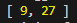
    </div>
  </li>
<li>
    <div style="display: flex; flex-direction: column">
        <div>Нужно написать функцию, которая проверяет, являются ли две строки анаграммами, причем регистр букв не имеет значения. Учитываются лишь символы; пробелы или знаки препинания в расчет не берутся.</div>
        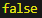
    </div>
  </li>
<li>
    <div style="display: flex; flex-direction: column">
        <div>Нужно написать функцию, принимающую строку в качестве аргумента и возвращающую количество гласных, которые содержатся в строке.
Гласными являются «a», «e», «i», «o», «u».</div>
        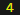
    </div>
  </li>
  <li>
    <div style="display: flex; flex-direction: column">
        <div>Треугольник. Напишите цикл,  выводит такой треугольник:</div>
        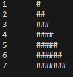
    </div>
  </li>
  <li>
    <div style="display: flex; flex-direction: column">
        <div>FizzBuzz. Напишите программу, которая выводит через console.log все числа от 1 до 100, с двумя исключениями. Для чисел, нацело делящихся на 3, она должна выводить ‘Fizz’, а для чисел, делящихся на 5 (но не на 3) – ‘Buzz’.Когда сумеете – исправьте её так, чтобы она выводила «FizzBuzz» для всех чисел, которые делятся и на 3 и на 5.</div>
        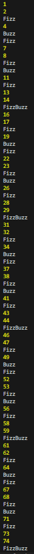
    </div>
  </li>
  <li>
    <div style="display: flex; flex-direction: column">
        <div>Шахматная доска. Напишите программу, создающую строку, содержащую решётку 8х8, в которой линии разделяются символами новой строки. На каждой позиции либо пробел, либо #. </div>
        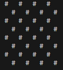
    </div>
  </li>
  <li>
    <div style="display: flex; flex-direction: column">
        <div>Минимум. Напишите функцию min, принимающую два аргумента, и возвращающую минимальный из них.</div>
        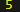
    </div>
  </li>
  <li>
    <div style="display: flex; flex-direction: column">
        <div>Рекурсия. Ноль чётный. Единица нечётная. У любого числа N чётность такая же, как у N-2. Напишите рекурсивную функцию isEven согласно этим правилам. Она должна принимать число и возвращать булевское значение. Потестируйте её на 50 и 75. Попробуйте задать ей -1. Почему она ведёт себя таким образом? Можно ли её как-то исправить?</div>
        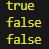
    </div>
  </li>
  <li>
    <div style="display: flex; flex-direction: column">
        <div>Считаем бобы. Символ номер N строки можно получить, добавив к ней .charAt(N) ( “строчка”.charAt(5) ) – схожим образом с получением длины строки при помощи .length. Возвращаемое значение будет строковым, состоящим из одного символа (к примеру, “к”). У первого символа строки позиция 0, что означает, что у последнего символа позиция будет string.length – 1. Другими словами, у строки из двух символов длина 2, а позиции её символов будут 0 и 1.Напишите функцию countBs, которая принимает строку в качестве аргумента, и возвращает количество символов “B”, содержащихся в строке.Затем напишите функцию countChar, которая работает примерно как countBs, только принимает второй параметр — символ, который мы будем искать в строке (вместо того, чтобы просто считать количество символов “B”). Для этого переделайте функцию countBs.</div>
        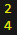
    </div>
  </li>
  <li>
    <div style="display: flex; flex-direction: column">
        <div>Сумма диапазона.  Напишите функцию range, принимающую два аргумента, начало и конец диапазона, и возвращающую массив, который содержит все числа из него, включая начальное и конечное.Затем напишите функцию sum, принимающую массив чисел и возвращающую их сумму. Запустите указанную выше инструкцию и убедитесь, что она возвращает 55.В качестве бонуса дополните функцию range, чтобы она могла принимать необязательный третий аргумент – шаг для построения массива. Если он не задан, шаг равен единице. Вызов функции range(1, 10, 2) должен будет вернуть [1, 3, 5, 7, 9]. Убедитесь, что она работает с отрицательным шагом так, что вызов range(5, 2, -1) возвращает [5, 4, 3, 2].</div>
        
    </div>
  </li>
  <li>
    <div style="display: flex; flex-direction: column">
        <div> Обращаем массив вспять. Напишите две функции, reverseArray и reverseArrayInPlace. Первая получает массив как аргумент и выдаёт новый массив, с обратным порядком элементов. Вторая работает как оригинальный метод reverse – она меняет порядок элементов на обратный в том массиве, который был ей передан в качестве аргумента. Не используйте стандартный метод reverse.</div>
        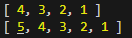
    </div>
  </li>
  <li>
    <div style="display: flex; flex-direction: column">
        <div>Глубокое сравнение. Оператор == сравнивает переменные объектов, проверяя, ссылаются ли они на один объект. Но иногда полезно было бы сравнить объекты по содержимому. Напишите функцию deepEqual, которая принимает два значения и возвращает true, только если это два одинаковых значения или это объекты, свойства которых имеют одинаковые значения, если их сравнивать рекурсивным вызовом deepEqual. Чтобы узнать, когда сравнивать величины через ===, а когда – объекты по содержимому, используйте оператор typeof. Если он выдаёт “object” для обеих величин, значит нужно делать глубокое сравнение. Не забудьте об одном дурацком исключении, случившемся из-за исторических причин: “typeof null” тоже возвращает “object”.</div>
        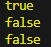
    </div>
  </li>
  <li>
    <div style="display: flex; flex-direction: column">
        <div>Свертка. Используйте метод reduce в комбинации с concat для свёртки массива массивов в один массив, у которого есть все элементы входных массивов.</div>
        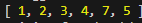
    </div>
  </li>
</ol>

<h1 align = "center">Вывод</h1>
<p>Выполнив данную лабораторную работу, я получил навыки работы с массивами, строками и объектами в JS.</p>
